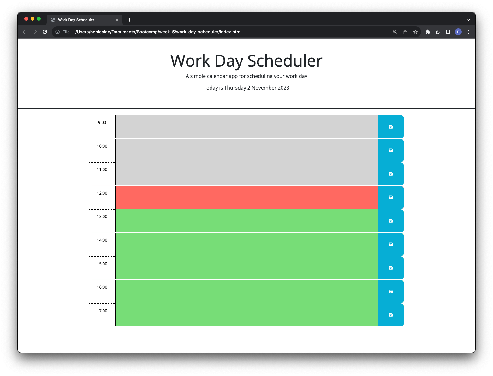
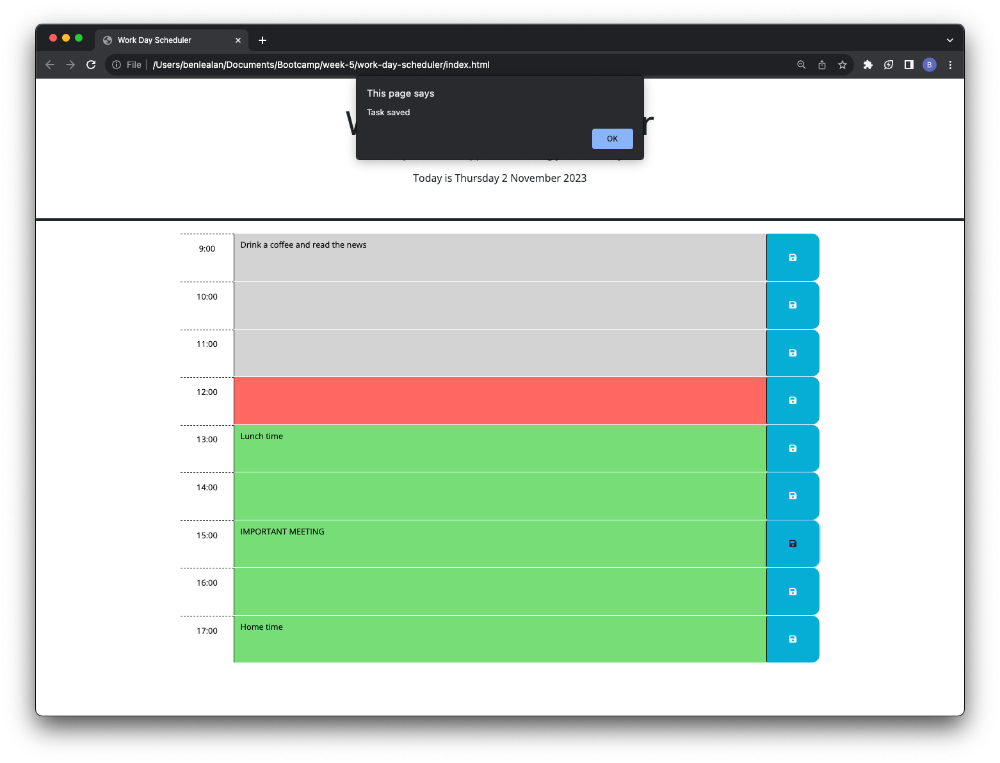
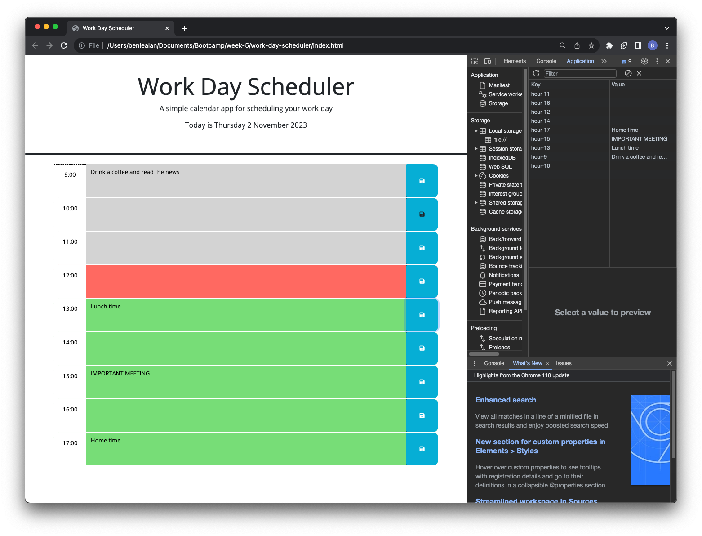

# Work Day Scheduler for Browser

## Description

This task required improving some given code for a Work Day Scheduler; having been provided with the HTML and CSS, the JavaScript needed to be written.

Firstly a function was written to generate the date based on the unix time, retrieved by dayjs(), which was then formatted to preference and displayed in the header of the HTML. 

Rather than writing nine separate code blocks in the HTML for the different times, I wrote a function whereby each time block was generated by jQuery in a for loop. As it iterated along an array of the desired times, separate elements were created and appended to mirror the initial examples provided. There was also an if statement to compare the time to that of the current time block, in order to style it accordingly by adding the corresponding class (past, present or future) that the CSS could effect).

An event listener was added to check for when the buttons were clicked. This would save the users typed input, and was tied to the id of the parent element, creating the key (the hour id) and the value (the task) which was saved to local storage. An alert pops up to notify the user that the change has been saved. I then added another assignment to the generateTimes() function, which would add the saved task (value) corresponding to the current hour (key) of the iteration, and insert it into the text area element. I also added a condition to save the variable as an empty string, so that it did not display "null" in the text ara.

## Usage

Below is a link to the live site and screenshots of the page showing it deployed:

- https://blealan.github.io/work-day-scheduler-b-lealan/

## Credits

- https://day.js.org/docs/en/display/format
- https://stackoverflow.com/questions/30607419/return-only-numbers-from-string
- https://www.w3schools.com/jquery/jquery_dom_get.asp#:~:text=Get%20Content%20%2D%20text()%2C%20html,the%20value%20of%20form%20fields
- https://www.w3schools.io/file/markdown-faq/